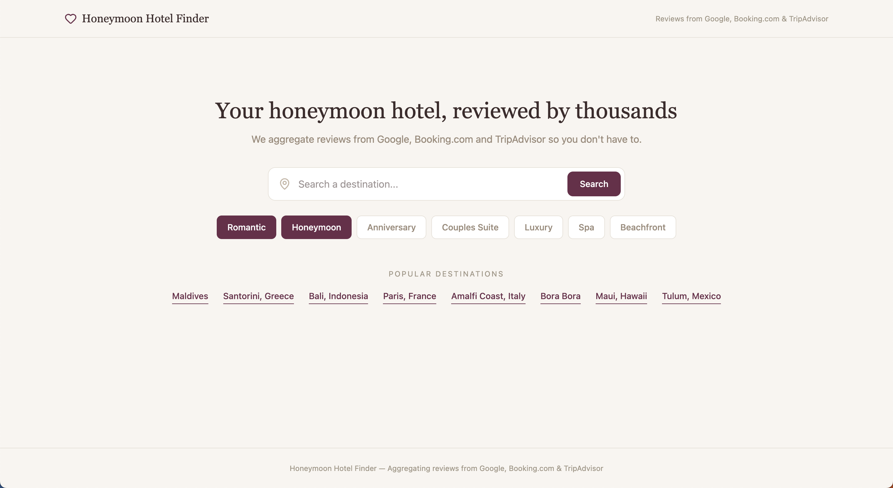
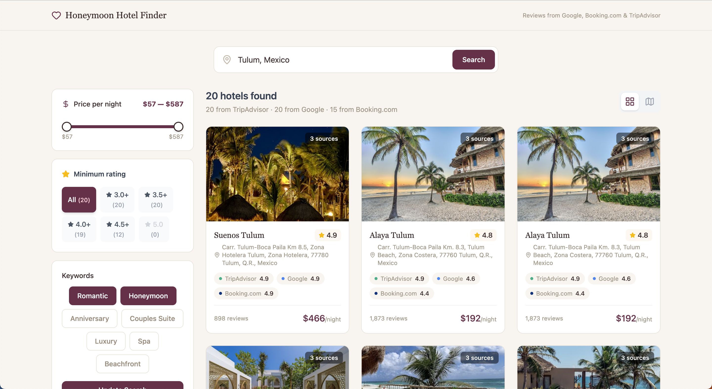
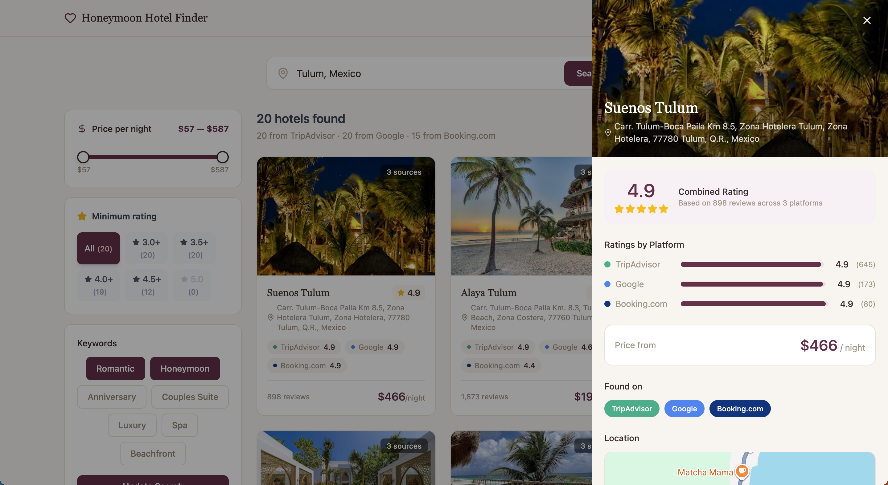
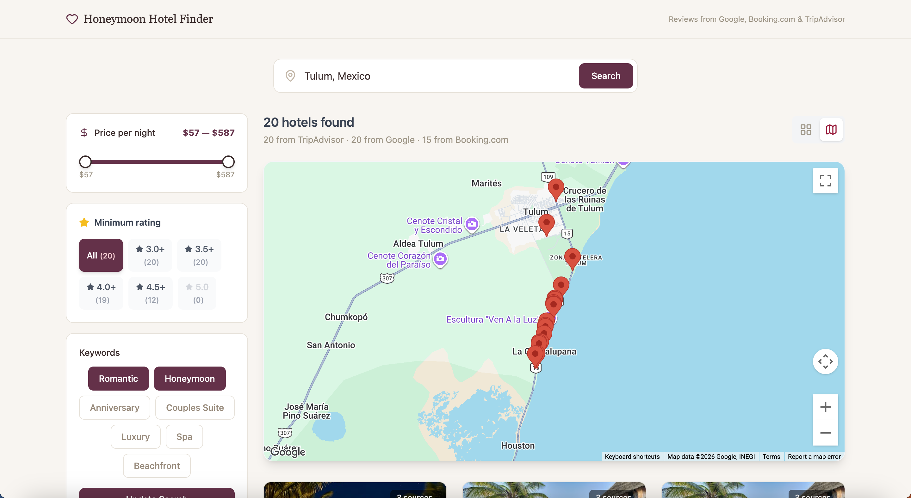
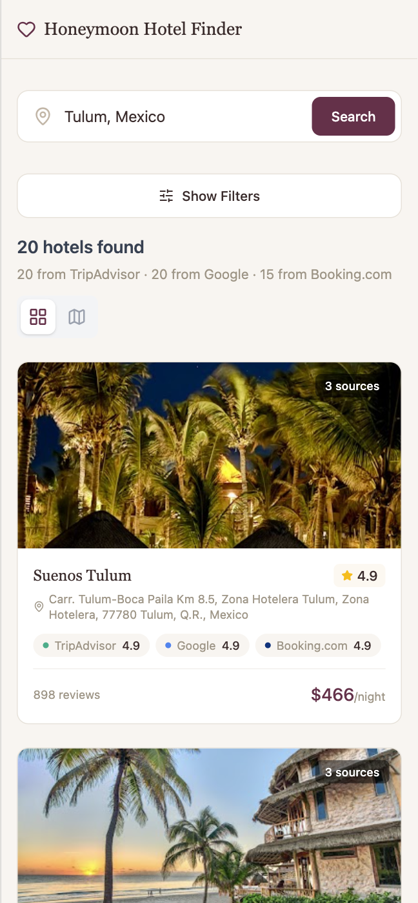

# Honeymoon Hotel Finder

**Live Demo:** [honeymoon-hotel-finder-4b17db7a2f56.herokuapp.com](https://honeymoon-hotel-finder-4b17db7a2f56.herokuapp.com/)

[](https://github.com/kasawyer/honeymoon-hotel-finder/actions/workflows/ci.yml)

A hotel review aggregation app that searches TripAdvisor, Google Places, and Booking.com simultaneously, merges ratings into a single weighted score, and streams results to the browser in real time via Server-Sent Events.

Built as a portfolio project to demonstrate full-stack development with Rails API, React, Redis caching, background jobs, and third-party API orchestration.


---

## Features

- **Three-source aggregation** — Searches TripAdvisor, Google Places, and Booking.com for each destination, merging ratings into a weighted combined score
- **Real-time streaming** — Server-Sent Events (SSE) stream results to the browser as they're enriched, with a live progress bar
- **Two-phase search** — First 20 results appear in ~30 seconds; additional pages load in the background and append automatically
- **Smart caching** — Redis caches search results and per-hotel lookups for one week, with nightly warming for popular destinations
- **Graceful degradation** — If a provider is down or rate-limited, results from remaining providers are shown with a notice
- **Interactive map** — Toggle between grid and map views; hotel detail panel includes an embedded Google Map
- **Filtering & pagination** — Filter by price range and minimum rating; paginate through 40-60+ results
- **Autocomplete** — Location search with Google Places autocomplete and debounced suggestions
- **Request deduplication** — Redis-based locks prevent duplicate API calls when multiple users search the same destination simultaneously
- **API rate tracking** — Monthly usage counters per provider with automatic cutoff at 95% to prevent overages

## Screenshots

### Home Page


### Search Results


### Hotel Detail


### Map View


### Mobile


---

## Architecture

```
┌─────────────────┐         SSE Stream          ┌─────────────────────────┐
│  React Frontend │◄────────────────────────────►│  Rails API (Puma)       │
│  (Vite + TS)    │                              │                         │
└────────┬────────┘                              │  SearchesController     │
         │                                       │    └─ StreamingHotel    │
         │  Google Maps JS                       │       Aggregator        │
         │  @react-google-maps/api               │         │               │
         │                                       │    ┌────┴────┐          │
         │                                       │    │         │          │
                                                 │  Phase 1  Phase 2      │
                                                 │  (pg 1)   (pg 2-3)    │
                                                 └────┬─────────┬────────┘
                                                      │         │
                                        ┌─────────────┼─────────┼─────────────┐
                                        │             │         │             │
                                   ┌────▼────┐  ┌────▼────┐  ┌─▼──────────┐  │
                                   │TripAdv. │  │ Google  │  │ Booking.com│  │
                                   │  API    │  │ Places  │  │    API     │  │
                                   │(primary)│  │(enrich) │  │  (enrich)  │  │
                                   └─────────┘  └─────────┘  └────────────┘  │
                                        │                                     │
                                   ┌────▼─────────────────────────────────┐   │
                                   │           Redis                      │   │
                                   │  • Search cache (1 week TTL)         │   │
                                   │  • Hotel lookup cache (1 week TTL)   │   │
                                   │  • Search locks (deduplication)      │   │
                                   │  • API usage counters (monthly)      │   │
                                   └──────────────────────────────────────┘   │
                                                                              │
                                   ┌──────────────────────────────────────┐   │
                                   │           Sidekiq                    │   │
                                   │  • Nightly cache warming (15 dest.)  │   │
                                   │  • On-demand destination warming     │   │
                                   └──────────────────────────────────────┘   │
                                                                              │
                                   ┌──────────────────────────────────────┐   │
                                   │         PostgreSQL                   │   │
                                   │  (available for future persistence)  │   │
                                   └──────────────────────────────────────┘
```

### Data Flow

1. User enters a destination and keywords
2. Frontend opens an SSE connection to `GET /api/v1/searches/stream`
3. Backend acquires a Redis lock (deduplication) and checks cache
4. **Phase 1:** Fetches page 1 from TripAdvisor (~20 hotels), enriches each with Google Places (coordinates, photos, rating) and Booking.com (rating, price, URL) in parallel batches of 3
5. Results are sorted by weighted rating and streamed to the frontend as a `complete` event
6. **Phase 2:** Pages 2-3 are fetched from TripAdvisor, enriched, and streamed as `more_results` events — the frontend appends and re-sorts in real time
7. Full result set is cached in Redis for one week

---

## Tech Stack

### Backend
- **Ruby on Rails 8** (API mode) — RESTful endpoints + SSE streaming
- **Redis** — Caching (search results, hotel lookups), request deduplication (distributed locks), API usage tracking, Sidekiq queue
- **Sidekiq** — Background job processing for nightly cache warming
- **PostgreSQL** — Database (available for future persistence features)
- **Faraday** — HTTP client for TripAdvisor, Google Places, and Booking.com APIs
- **Sentry** — Error tracking and performance monitoring

### Frontend
- **React 18** — Component-based UI with hooks
- **TypeScript** — Typed API client, SSE hook, and data interfaces
- **Vite** — Fast dev server and production builds
- **Tailwind CSS** — Utility-first styling with warm editorial design system
- **@react-google-maps/api** — Interactive maps with markers and InfoWindows
- **Lucide React** — Icon library

### Infrastructure
- **Heroku** — Production hosting (web + worker dynos)
- **GitHub Actions** — CI/CD (RSpec, Vitest, Cypress, ESLint, RuboCop)
- **Docker Compose** — Local development environment

### External APIs
| Provider | Purpose | Authentication |
|----------|---------|----------------|
| TripAdvisor (via RapidAPI) | Primary hotel search + ratings | `X-RapidAPI-Key` header |
| Google Places (New) | Geocoding, photos, ratings, autocomplete | `X-Goog-Api-Key` header |
| Booking.com (via RapidAPI) | Ratings, prices, booking URLs | `X-RapidAPI-Key` header |

---

## Getting Started

### Prerequisites

- Ruby 3.2+
- Node.js 20+
- PostgreSQL 15+
- Redis 7+
- API keys: [Google Maps Platform](https://console.cloud.google.com/), [RapidAPI](https://rapidapi.com/) (TripAdvisor16 + Booking.com15)

### Setup

```bash
# Clone the repo
git clone https://github.com/kasawyer/honeymoon-hotel-finder.git
cd honeymoon-hotel-finder

# Environment variables
cp .env.example .env
# Edit .env with your API keys:
#   GOOGLE_MAPS_API_KEY=your_key
#   RAPIDAPI_KEY=your_key
#   VITE_GOOGLE_MAPS_API_KEY=your_key

# Backend
bundle install
cd backend
rails db:create db:migrate
cd ..

# Frontend
cd frontend
npm install
cd ..
```

### Running Locally

```bash
# Terminal 1 — Rails API
cd backend && bundle exec rails server -p 3001

# Terminal 2 — React dev server
cd frontend && npm run dev

# Terminal 3 — Redis (if not running as a service)
redis-server

# Terminal 4 — Sidekiq (optional, for background jobs)
cd backend && bundle exec sidekiq
```

Visit [http://localhost:5173](http://localhost:5173)

### Docker Compose

```bash
docker-compose up
```

This starts PostgreSQL, Redis, the Rails API, the React frontend, and a Sidekiq worker.

---

## Testing

### Backend (RSpec)

```bash
cd backend
bundle exec rspec                    # All tests
bundle exec rspec spec/services/     # Service tests only
bundle exec rspec spec/requests/     # Controller tests only
```

### Frontend (Vitest)

```bash
cd frontend
npm run test:run                     # All tests
npm run test:run -- --reporter=verbose  # Verbose output
```

### End-to-End (Cypress)

```bash
cd frontend
npm run test:e2e                     # Headless
npx cypress open                     # Interactive
```

### Linting

```bash
# Ruby
bundle exec rubocop

# JavaScript/TypeScript
cd frontend && npx eslint src/ && npx prettier --check src/
```

---

## API Documentation

Full endpoint reference: **[docs/api.md](docs/api.md)**

Quick summary:

| Endpoint | Method | Description |
|----------|--------|-------------|
| `/api/v1/searches` | POST | Standard JSON hotel search |
| `/api/v1/searches/stream` | GET | SSE streaming hotel search |
| `/api/v1/locations` | GET | Autocomplete location suggestions |
| `/api/v1/status` | GET | API usage stats and provider health |

---

## Project Structure

```
honeymoon-hotel-finder/
├── Gemfile                          # Ruby dependencies (project root for Heroku)
├── Procfile                         # Heroku process definitions
├── package.json                     # Root package.json for Heroku Node buildpack
├── docker-compose.yml               # Local dev environment
├── .github/workflows/ci.yml         # GitHub Actions CI/CD
│
├── backend/                         # Rails API
│   ├── app/
│   │   ├── controllers/api/v1/      # SearchesController, LocationsController, StatusController
│   │   ├── services/                # Core business logic
│   │   │   ├── hotel_aggregator.rb           # Orchestrates multi-provider search
│   │   │   ├── streaming_hotel_aggregator.rb # SSE streaming subclass
│   │   │   ├── tripadvisor_service.rb        # TripAdvisor API client
│   │   │   ├── google_places_service.rb      # Google Places API client
│   │   │   ├── hotel_cache.rb                # Redis caching layer
│   │   │   ├── search_lock.rb                # Request deduplication
│   │   │   └── api_usage_tracker.rb          # Monthly rate limit tracking
│   │   └── jobs/                    # Sidekiq background jobs
│   ├── config/                      # Rails configuration
│   └── spec/                        # RSpec tests
│
├── frontend/                        # React SPA
│   ├── src/
│   │   ├── components/              # UI components (HotelCard, HotelDetail, MapView, etc.)
│   │   ├── pages/                   # HomePage, ResultsPage
│   │   ├── hooks/                   # useStreamingSearch (SSE hook)
│   │   ├── types/                   # TypeScript interfaces
│   │   └── api/                     # Typed API client
│   └── cypress/                     # E2E tests
│
└── docs/
    ├── api.md                       # API endpoint reference
    └── images/                      # Screenshots and demo GIF
```

---

## Key Design Decisions

**Why SSE instead of WebSockets?** Hotel search takes 30-90 seconds across three APIs. SSE provides server-to-client streaming with simpler infrastructure (no WebSocket server), automatic reconnection, and native `EventSource` browser support. The unidirectional nature fits perfectly since the client only needs to receive progress updates and results.

**Why two-phase search?** Users see useful results in ~30 seconds (Phase 1: 20 hotels), while Phase 2 fetches 20-40 more in the background. This balances speed with completeness — filters and pagination become more useful as the result set grows.

**Why Redis for caching instead of a database?** Hotel review scores change slowly (a 4.7 today is still a 4.7 next week). Redis provides sub-millisecond reads with automatic TTL expiration, and we already need it for Sidekiq and request deduplication. One-week TTLs with nightly warming for popular destinations keeps data fresh without burning API calls.

**Why weighted average instead of simple average?** Providers have different review volumes. A 4.8 from 3,000 TripAdvisor reviews is more reliable than a 4.9 from 50 Booking.com reviews. The weighted average gives more influence to sources with more data.

---

## License

This project is for portfolio demonstration purposes.